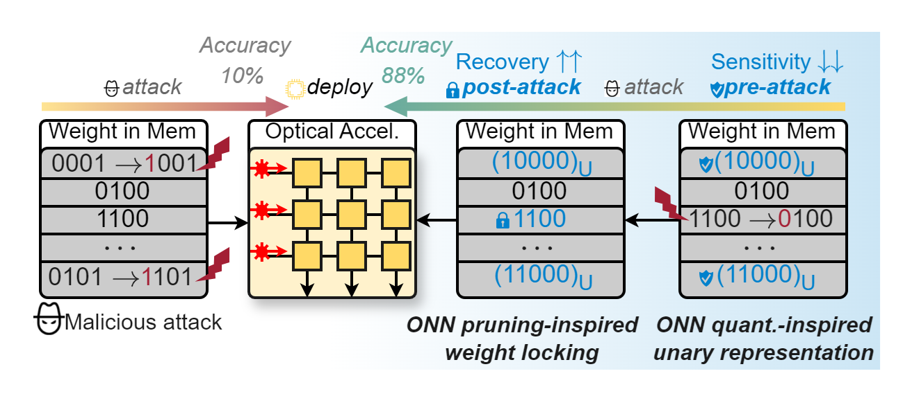

# ONN Defender

By [Haotian Lu](https://github.com/TRIGGERONE), Ziang Yin, Partho Bhoumik, Sanmitra Banerjee, Krishnendu Chakrabarty and [Jiaqi Gu](https://github.com/JeremieMelo).

This repo is the official implementation of "[The Unlikely Hero: Nonidealities in Analog Photonic Neural Networks as Built-in Adversarial Defenders](https://arxiv.org/abs/2410.01289)", published at ACM/IEEE ASP-DAC 2025.

# Introduction
**ONN Defender** is a synergistic defense framework tailored for optical analog hardware that *proactively protects sensitive weights via pre-attack unary weight encoding* and *post-attack vulnerability-aware weight locking*.

**ONN Defender** leverages the non-idealities in optical analog hardware to serve as a built-in defense against adversarial attack. **ONN Defender** first minimizes the weight sensitivity using pre-attack truncated complementary unary weight representation. To boost the coverage of weight protection under small memory overhead, Sensitivity-aware Weight Locking is utilized to resume accuracy with selective and precise error correction.


**ONN Defender** can resume accuracy to **near-ideal on-chip inference accuracy** (with only a 2% drop) after BFA attacks with marginal (**less than 3%**) memory overhead, outperforms outperforms prior defense approaches, when benchmarked on various models and learning tasks.
This synergistic framework is the *first* re-training-free nonideality-enabled built-in defender against adversarial bit-flip attacks that ensures *continued reliability* with *minimal overhead* and makes significant strides toward reliable ONN against adversarial weight attacks and unlocking future applications in security-thirst scenarios.


# Dependencies
* Python >= 3.10
* pyutils >= 0.0.2. See [pyutils](https://github.com/JeremieMelo/pyutility) for installation.
* pytorch-onn >= 0.0.8. See [pytorch-onn](https://github.com/JeremieMelo/pytorch-onn) for installation.
* Python libraries listed in `requirements.txt`
* NVIDIA GPUs and CUDA >= 11.8

# Structures
* core/
    * models/
        * layers/
            * base_layer: Base layer definition; apply different types of noise
            * gemm_conv2d and gemm_linear layers
            * utils.py: Noise schedulers for weights and activations
        * attack/
            * attacker: Bit-flip based smart adversarial attacker, apply malicious attack
            * defender: Apply Truncated complementary Unary representation to selected indices to perform build-in defense 
            * post_pruner, post_locker: Apply Weight Pruning/Locking as post-attack protection
            * post_recovery: Return the attacked accuracy with TCU and Weight Locking protection.
        * quantize/
            * quantizer: Quantization of weights and activations.
        * sparse_bp_\*.py: model definitions
        * sparse_bp_base.py: base model definition.
    * builder.py: build training utilities
* script/: contains experiment scripts
* train_pretrain.py: training logic, includes noise-free training and noise-aware training 

# Usage
* Pretrain model.\
`> python3 train_pretrain.py config/cifar10/vgg8/pretrain.yml`

* Apply malicious adversarial attack on pretrained model. Please set your hyperparameters in CONFIG=`config/cifar10/vgg8/attacker/attacker.yml` and run SCRIPT=`script/cifar10/vgg8/attacker_performance/attack.py`\
`> python3 SCRIPT`

* Truncated Complementary Unary representation. The index of selected weights to be transformed will be generated and saved as .pkl file. Please set your hyperparameters in CONFIG=`config/cifar10/vgg8/defender/defender.yml` and SCRIPT=`script/cifar10/vgg8/defender/gen_protection.py`run\
`> python3 SCRIPT`

* Sensitivity-aware Weight Locking as Post-attack protection. The group index of weights and cluster centers will be generated and saved as .pkl files. Please set your hyperparameters in CONFIG=`config/cifar10/vgg8/locker/locker.yml` and SCRIPT=`script/cifar10/vgg8/locker/get_locking_weights.py`run\
`> python3 SCRIPT`

* Protection effectiveness evaluation with TCU and Weight Locking. Please set your hyperparameters in CONFIG=`config/cifar10/vgg8/recovery/recovery.yml` and SCRIPT=`script/cifar10/vgg8/recovery/recovery.py`run\
`> python3 SCRIPT`

* All scripts for experiments are in `./script`. For example, to only run Truncated Complementary Unary representation, you can write the proper task setting in SCRIPT=`script/cifar10/vgg8/defender/gen_protection.py` and run\
`> python3 SCRIPT`

* Comparison experiments with Noise-aware Training. Run with the SCRIPT=`script/cifar10/vgg8/mainresult/main_result.py`\
`> python3 SCRIPT`

# Citing ONN Defender
```
@inproceedings{lu2024ONN_Defender,
      title={{The Unlikely Hero: Nonideality in Analog Photonic Neural Networks as Built-in Defender Against Adversarial Attacks}}, 
      author={Lu, Haotian and Yin, Ziang and Bhoumik, Partho and Banerjee, Sanmitra and Chakrabarty, Krishnendu and Gu, Jiaqi},
      booktitle={ACM/IEEE Asia and South Pacific Design Automation Conference (ASP-DAC)},
      year={2024},
}
```
